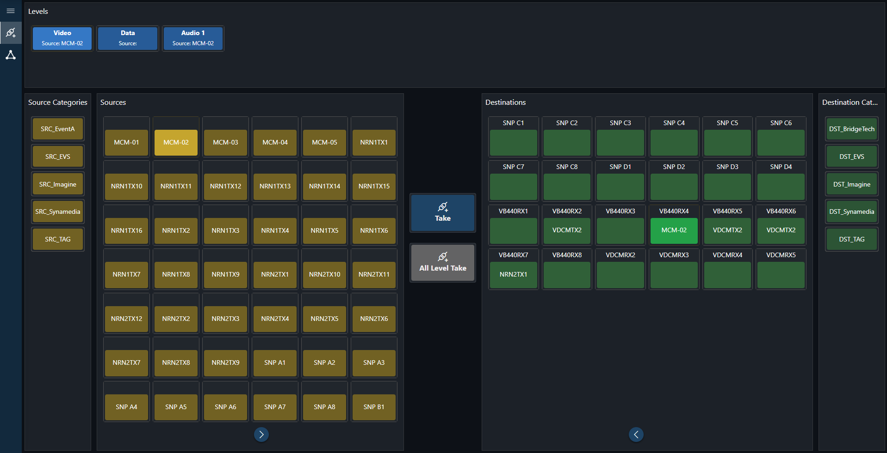

# EVS Cerebrum

## Overview

Unlock the full potential of your operations with the powerful integration of EVS Cerebrum and DataMiner. DataMiner establishes connectivity, setting crosspoints between pre-reserved resources, ideal for streamlining tasks like pre-configuring feeds for fiber contribution jobs in the MCR. Crosspoint commands are sent to Cerebrum for this purpose. Designed to simplify your workflow, the EVS Cerebrum application offers a **user-friendly** and **intuitive** interface that makes setting crosspoints quicker and more efficient than ever before.

## Key Features

- **Overview**: Visualization of all existing mnemonics, levels, and categories.
- **Router Control Panel**: With just a few clicks, a route connection can be established through a user-friendly interface.

## Using the application

The primary use of the application is to set up a route connection.

- To do this:

  1. Select a source, destination, and level.

  1. Click the *Take* button.

     Once the route is established, the connected source will be visible on the designated destination and level(s).

- To set up routes for all levels simultaneously, click the *All Level Take* button.

> [!NOTE]
> For detailed documentation about the EVS Cerebrum application, refer to DataMiner Docs: [EVS Cerebrum](https://docs.dataminer.services/solutions/product_solutions/EVS_Cerebrum/EVS_Cerebrum.html).

## Prerequisites

To deploy this item from the Catalog, you will need:

- DataMiner version 10.4.4 or higher.

- A DataMiner System [connected to dataminer.services](https://docs.dataminer.services/user-guide/Cloud_Platform/Connecting_to_cloud/Connecting_your_DataMiner_System_to_the_cloud.html).

## Installation and configuration

### Step 1: Deploy the EVS Cerebrum application

1. Click the *Deploy* button.

1. Select the target DataMiner System and confirm the deployment. The package will be pushed to the DataMiner System.

1. Optionally verify that the deployment was successful in [the Admin app](https://admin.dataminer.services/), where you can check the status of the deployment.

### Step 2: Access the EVS Cerebrum application

1. Go to `http(s)://[DMA name]/root`.

1. Select *EVS Cerebrum* to start using the application.

## Support

For additional help, please reach out to [Tech Support](mailto:techsupport@skyline.be).
